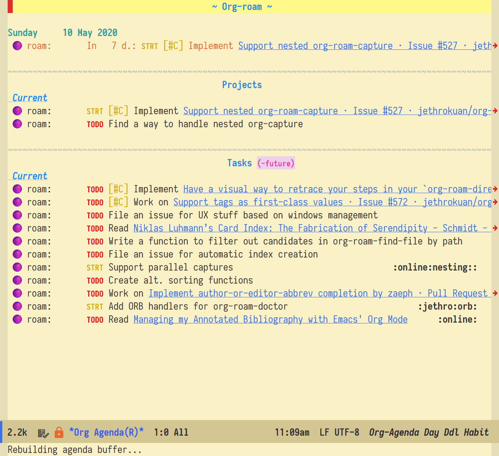
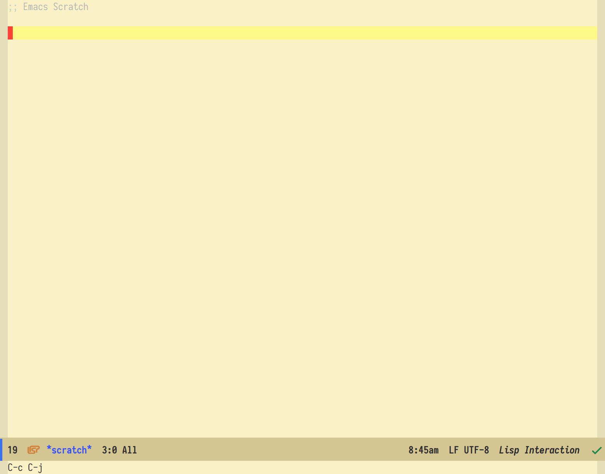

This repository contains my personal configuration for Emacs.

### A word of warning 🚧

This project is in **alpha**, and as such, it is **work in progress**.

Whilst most of the code featured in this repository contains informative names, docstrings, and comments, there are some *dark spots*.  This is because I have been refining my configuration over the years, electing to keep as much of my old code as possible when refactoring.

The consequence of that is that some of the older functions were written in *Baby Elisp*, dating back to a time when programming for me was more *alchemy* than *science* to me.

### A word of thanks

I'm hugely indebted to **Bernt Hansen** and his article on Org-mode: [Organize Your Life In Plain Text!](http://doc.norang.ca/org-mode.html).

It has been a *constant* source of inspiration for the workflows I wanted to implement.

Also, some of the code dates back to a time where I was much less diligent about keeping the sources of the pieces of code I was copy/pasting.  If your code made it into my config without due recognition, please let me know.

### Goals 🚀

A `1.0.0` version of this project would be a documented, fully-modularised configuration à la [purcell](https://github.com/purcell/emacs.d).  I am about a third of the way in.

In the meantime, feel free to explore what I’ve written.

#### Demonstrations

You might be interested in my [`org-agenda` config](lisp/zp-org-agenda.el), especially some of the helper functions I’ve written to organise my `org-agenda-custom-commands`.

Here's a demonstration of the toggles I can use in my custom-views:

        

And here's a demonstration on the state-flow of my tasks, as well as the fluid definition of a project:

    

You might also be interested in [`zp-hydra-org-refile`](lisp/zp-hydra-org-refile), a collection of commands, functions, and macros to help me manoeuvre around the single Org-mode file I use for organisation.

    

### Questions?

For help, support, or if you just want to chat, you can find me here:
* **IRC**: channels **#ranger** and **#org-roam** on [freenode](https://freenode.net/kb/answer/chat)
* **Slack**: [Org Roam](https://join.slack.com/t/orgroam/shared_invite/zt-deoqamys-043YQ~s5Tay3iJ5QRI~Lxg)
